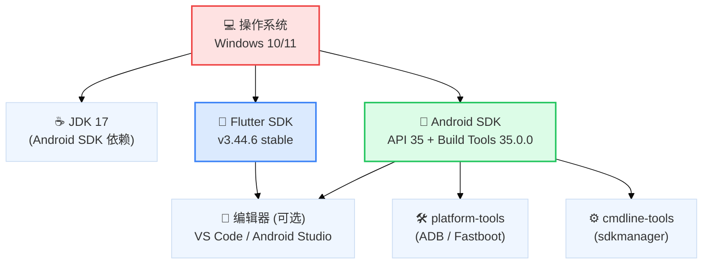
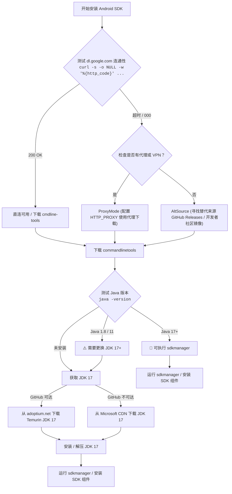
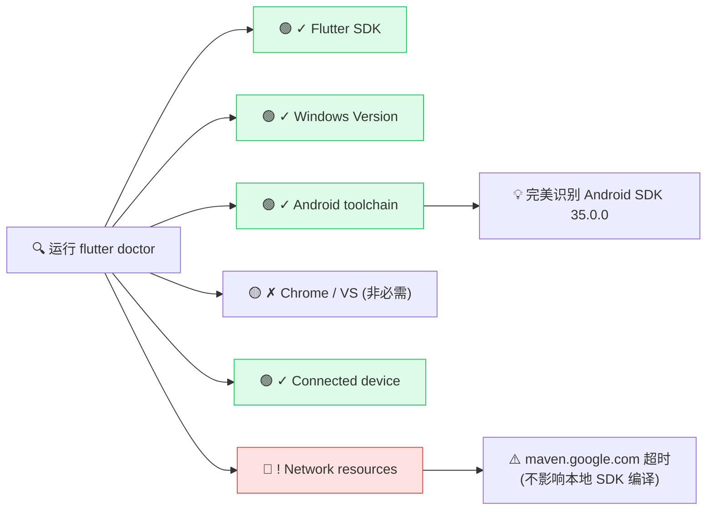

# Flutter + Android SDK 开发环境配置

---
::: info 💡 写在前面
- 适用平台：Windows 10/11

- 核心版本：Flutter 3.44.6 stable | Android SDK API 35 | Build Tools 35.0.0 | JDK 17
:::

::: tip 📢 注意
- 接下来的教程用 `D:\Devtools` 做为开发工具的安装目录，请根据个人情况自行修改
:::

- 🤔 为什么不直接用 Android Studio？
  - Android Studio 体积通常超过 1.5G，且大部分功能属于 IDE 图形界面代码。为了保持系统轻量纯净，本教程推荐使用 VS Code 配合 Android SDK 命令行工具（cmdline-tools）进行纯命令行式配置
---
## 一、环境概览

### 完整依赖关系



### 最小磁盘占用

| 组件 | 典型大小 | 说明 |
|------|---------|------|
| Flutter SDK | ~1.2 GB | 含 Dart 编译器、引擎 |
| JDK 17 | ~180 MB | 仅命令行版本 |
| Android cmdline-tools | ~130 MB | 纯命令行，不含 IDE |
| platform-tools | ~10 MB | ADB、fastboot |
| build-tools + platform | ~200 MB | 编译工具链 |
| **总计** | **~1.7 GB** | 若使用Android Studio 则约 4 GB+ |

---

## 二、安装 Flutter SDK

### 前置工具

- **[Git for Windows](https://git-scm.com/download/win)**
- **[Visual Studio Code](https://code.visualstudio.com/)**   — 推荐 IDE
- **[Android Studio](https://developer.android.com/studio)** — 可选 IDE
> 如有安装问题可以参考：
> - [Git for Windows 安装问题](https://git-scm.com/book/zh/v2/)
> - [Flutter 安装问题](https://docs.flutter.cn/install/troubleshoot)
> - [Android Studio 安装问题](https://developer.android.com/blog/categories/how-tos)
> - [VSCode 安装问题](https://cloud.tencent.com/developer/article/2586907)  
> __Ps ``VsCode安装问题排查教程引用自:https://cloud.tencent.com/developer/article/2586907``__

### 下载与解压

- 💡 本教程以当前的稳定版 Flutter SDK 3.44.6 为基准进行演练。若你项目有特殊版本需求，可前往官方镜像源获取对应包，整体配置流程完全一致。
- 下载 [Flutter SDK 3.44.6 stable](https://storage.flutter-io.cn/flutter_infra_release/releases/stable/windows/flutter_windows_3.44.6-stable.zip?_gl=1*1wjho9v*_ga*MTQ3MTM2MzczLjE3ODM3NTY0NDg.*_ga_HPSFTRXK91*czE3ODM4MjcwMjYkbzQkZzEkdDE3ODM4Mjc4ODIkajU1JGwwJGgw)
```shell
# 解压到目标目录（例如 D:\DevTools\FlutterSDK）
Expand-Archive -Path flutter_windows_3.44.6-stable.zip `
               -DestinationPath D:\DevTools\FlutterSDK
```

### 配置环境变量

1. 按下 `Win` 键，搜索 **环境变量**

2. 在 **用户变量** 的 `Path` 中添加：
   ```
   D:\DevTools\FlutterSDK\flutter\bin
   ```

3. 验证安装：
  
  ```shell
  flutter --version
  dart --version
  ```
  > **注意**：首次运行 `flutter --version` 时，Flutter 会自动下载 Dart SDK 等依赖，请保持网络畅通。

  ---

## 三、安装 Android SDK

**注意**：由于版权问题,国内用户无法直接从 Google 下载 Android SDK，国内镜像源也不提供镜像下载服务。
> **消息来源:**[清华大学开源软件AOSP镜像](https://mirrors.tuna.tsinghua.edu.cn/help/AOSP/)

### 3.1 网络诊断与策略选择

在国内网络环境下安装 Android SDK 可能遇到访问限制。以下决策树可帮助快速定位可行方案：



#### 相关命令

```shell
# 测试连通性
curl -I https://dl.google.com
curl -I https://developer.android.com/studio

# 测试https://developer.android.com/studio的连通性时 
# 遇到超时或其他问题，不影响直连下载(如过可以直接访问https://dl.google.com话)
```


### 3.2 安装 JDK 17

最新版 cmdline-tools 依赖 Java 17+（class file version 61.0），Java 1.8 和 11 均无法运行。

#### 方案：Microsoft OpenJDK 17（国内 CDN 可达）

```shell
# 通过 Microsoft CDN 直链下载（国内速度良好）
# akasa.ms 短链会自动重定向到最新版本
curl.exe -L -o D:\DevTools\OpenJDK17.zip `
  "https://aka.ms/download-jdk/microsoft-jdk-17.0.13-windows-x64.zip"

# 解压到指定目录
Expand-Archive -Path D:\DevTools\OpenJDK17.zip `
               -DestinationPath D:\DevTools\jdk-17
```

> **其他备选下载源**：
> - [Adoptium Temurin 17](https://adoptium.net/temurin/releases/?version=17) — Eclipse 基金会维护，开源免费
> - [华为云镜像](https://repo.huaweicloud.com/java/jdk/) — 部分版本支持国内镜像下载

#### 验证 JDK

```shell
& "D:\DevTools\jdk-17\jdk-17.0.13+11\bin\java.exe" -version

# 期望输出：
# openjdk version "17.0.13" 2024-10-15 LTS
# OpenJDK 64-Bit Server VM (build 17.0.13+11-LTS, mixed mode, sharing)
```

### 3.3 下载 Command Line Tools

Android 命令行工具包约 150 MB，包含 `sdkmanager`、`avdmanager`、`apkanalyzer` 等核心工具。

```shell
# 从 dl.google.com 下载
curl.exe -L -o D:\DevTools\commandlinetools-win.zip `
  "https://dl.google.com/android/repository/commandlinetools-win-11076708_latest.zip"
```

#### 目录结构规范

Android SDK 要求 cmdline-tools 安装在特定路径下：

```shell
# 1. 创建标准目录结构
New-Item -ItemType Directory -Path "D:\DevTools\android-sdk\cmdline-tools\latest" -Force

# 2. 解压并移动到正确位置
Expand-Archive -Path D:\DevTools\commandlinetools-win.zip `
               -DestinationPath "$env:TEMP\android-clt"
Move-Item -Path "$env:TEMP\android-clt\cmdline-tools\*" `
          -Destination "D:\DevTools\android-sdk\cmdline-tools\latest\"

# 3. 清理临时文件
Remove-Item "$env:TEMP\android-clt" -Recurse -Force
Remove-Item D:\DevTools\commandlinetools-win.zip -Force
```

最终目录结构：

```
D:\DevTools\android-sdk\
├── cmdline-tools\
│   └── latest\
│       ├── bin\
│       │   ├── sdkmanager.bat    ← SDK 包管理器
│       │   ├── avdmanager.bat    ← 虚拟设备管理器
│       │   └── apkanalyzer.bat   ← APK 分析器
│       └── lib\
├── platforms\          ←（安装后生成）
├── build-tools\        ←（安装后生成）
└── platform-tools\     ←（安装后生成）
```

### 3.4 安装 SDK 组件

```shell
# 设置临时环境变量（当前会话）
$env:JAVA_HOME = "D:\DevTools\jdk-17\jdk-17.0.13+11"
$env:ANDROID_HOME = "D:\DevTools\android-sdk"

# 列出可用包（可选）
& "D:\DevTools\android-sdk\cmdline-tools\latest\bin\sdkmanager.bat" `
  --list --sdk_root="$env:ANDROID_HOME"

# 安装核心组件
echo y | & "$env:ANDROID_HOME\cmdline-tools\latest\bin\sdkmanager.bat" `
  "platforms;android-35" `
  "build-tools;35.0.0" `
  "platform-tools" `
  --sdk_root="$env:ANDROID_HOME"
```

安装内容说明：

| 包名 | 版本 | 用途 | 大小 |
|------|------|------|------|
| `platforms;android-36` | r02 | Android 36 平台 SDK | ~80 MB |
| `build-tools;35.0.0` | 35.0.0 | 编译工具（aapt、d8、aidl） | ~50 MB |
| `platform-tools` | r37.0.0 | ADB、fastboot | ~10 MB |

> **提示**：如果 `flutter doctor` 提示需要特定版本的 build-tools（如 28.0.3），按需补充安装即可：
> ```shell
> echo y | sdkmanager.bat "build-tools;28.0.3" --sdk_root="D:\DevTools\android-sdk"
> ```

### 3.5 配置环境变量

#### 图形界面方式

1. 按下 `Win` 键，搜索 **环境变量**
2. 在 **用户变量** 中新增：

| 变量名 | 值 |
|--------|-----|
| `ANDROID_HOME` | `D:\DevTools\android-sdk` |
| `ANDROID_SDK_ROOT` | `D:\DevTools\android-sdk` |
| `JAVA_HOME` | `D:\DevTools\jdk-17\jdk-17.0.13+11` |

3. 在 `Path` 中添加：
   - `%ANDROID_HOME%\platform-tools`
   - `%ANDROID_HOME%\cmdline-tools\latest\bin`
   - `%JAVA_HOME%\bin`

#### 命令行方式

```shell
[Environment]::SetEnvironmentVariable("ANDROID_HOME", "D:\DevTools\android-sdk", "User")
[Environment]::SetEnvironmentVariable("ANDROID_SDK_ROOT", "D:\DevTools\android-sdk", "User")
[Environment]::SetEnvironmentVariable("JAVA_HOME", "D:\DevTools\jdk-17\jdk-17.0.13+11", "User")
```

#### Flutter 项目配置

```shell
# 全局配置
flutter config --android-sdk "D:\DevTools\android-sdk"

# 项目级配置（写入 android/local.properties）
# sdk.dir=D\:\\DevTools\\android-sdk
```

---

## 四、验证

### 接受 License

首次使用 sdkmanager 或 flutter 时需要接受 Google 的 SDK 许可协议：

```shell
# 全部接受
& "D:\DevTools\android-sdk\cmdline-tools\latest\bin\sdkmanager.bat" `
  --licenses --sdk_root="D:\DevTools\android-sdk"

# 或通过 flutter 工具接受
flutter doctor --android-licenses
```

### 运行 flutter doctor

```shell
$env:ANDROID_HOME = "D:\DevTools\android-sdk"
$env:JAVA_HOME = "D:\DevTools\jdk-17\jdk-17.0.13+11"
flutter doctor
```

#### 期望结果



**关键输出**：`[✓] Android toolchain - develop for Android devices (Android SDK version 35.0.0)`

这表示 Android 开发环境已就绪。`Chrome` 和 `Visual Studio` 的 ✗ 标记分别对应 Web 和 Windows 桌面开发，如果只开发 Android 手机端，可以忽略。

---

## 五、常见问题

### Q1: sdkmanager 报错 "class file version 61.0"

**原因**：Java 版本过低。当前 Java 版本不支持 class file version 61.0（Java 17）。

**解决**：安装 JDK 17+ 并将 `JAVA_HOME` 指向新 JDK。

### Q2: dl.google.com 可以访问但下载失败

**原因**：可能是网络抖动或下载超时。

**解决**：
```shell
# 使用 curl 断点续传（-C -）
curl.exe -C - -L -o D:\DevTools\commandlinetools-win.zip `
  "https://dl.google.com/android/repository/commandlinetools-win-11076708_latest.zip"
```

### Q3: flutter doctor 提示 "Android licenses not accepted"

**原因**：部分 SDK 组件许可协议未签署。

**解决**：
```shell
# 方法一：sdkmanager 交互式接受
sdkmanager.bat --licenses --sdk_root="D:\DevTools\android-sdk"
# 反复输入 y + Enter 直到显示 "All SDK package licenses accepted"

# 方法二：一次性管道输入（Windows PowerShell）
"yyyyyyy" | sdkmanager.bat --licenses --sdk_root="D:\DevTools\android-sdk"
```

### Q4: maven.google.com 超时（Gradle 构建失败）

**原因**：国内网络环境无法直接访问 Google Maven 仓库。

**解决**：配置项目级 Gradle 使用阿里云镜像：

```groovy
// 📂 修改项目根目录下的 android/build.gradle（或 settings.gradle.kts）：
// 在 repositories 中添加国内镜像
pluginManagement {
    repositories {
        maven { url 'https://maven.aliyun.com/repository/public' }
        maven { url 'https://maven.aliyun.com/repository/google' }
        google()
        mavenCentral()
    }
}
```

---

> **参考链接**
>
> - [Flutter 中文开发者文档](http://docs.flutter.cn)
> - [Flutter 安装问题排查](https://docs.flutter.cn/install/troubleshoot)
> - [Android Studio 命令行工具文档](https://developer.android.com/studio/command-line)
> - [清华大学开源镜像站 - AOSP 镜像说明](https://mirrors.tuna.tsinghua.edu.cn/help/AOSP/)
