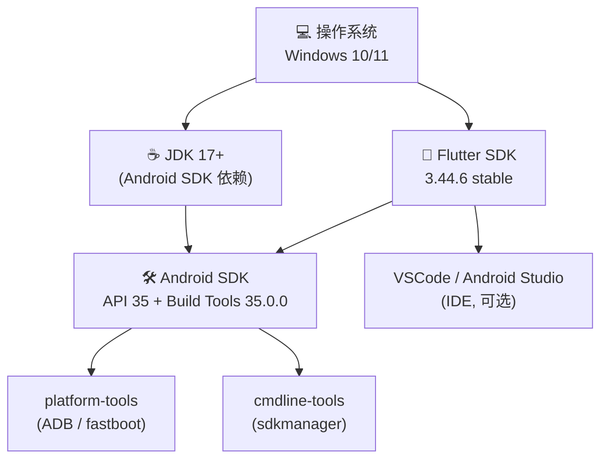
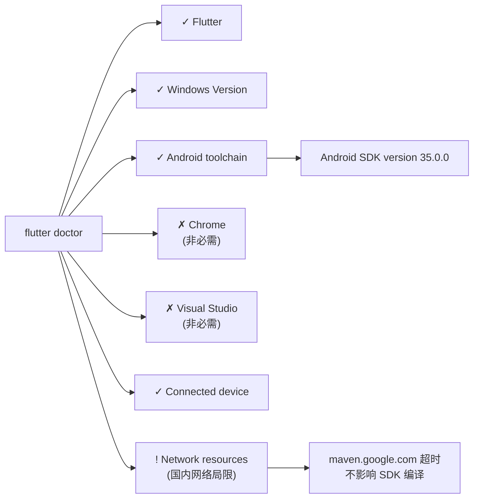

# Flutter + Android SDK 开发环境配置手册

> **适用平台**: Windows 10/11 | **最后更新**: 2026-07 | **Flutter**: 3.44.6 stable

---

## 目录

- [一、环境概览](#一环境概览)
- [二、安装 Flutter SDK](#二安装-flutter-sdk)
- [三、安装 Android SDK](#三安装-android-sdk)
  - [3.1 网络诊断与策略选择](#31-网络诊断与策略选择)
  - [3.2 安装 JDK 17](#32-安装-jdk-17)
  - [3.3 下载 Command Line Tools](#33-下载-command-line-tools)
  - [3.4 安装 SDK 组件](#34-安装-sdk-组件)
  - [3.5 配置环境变量](#35-配置环境变量)
- [四、验证](#四验证)
- [五、常见问题](#五常见问题)

---

## 一、环境概览

### 完整依赖关系



### 最小磁盘占用

| 组件 | 典型大小 | 说明 |
|------|---------|------|
| Flutter SDK | ~1.2 GB | 含 Dart 编译器、引擎 |
| JDK 17 | ~180 MB | 仅命令行版本 |
| Android cmdline-tools | ~130 MB | 纯命令行，不含 IDE |
| platform-tools | ~10 MB | ADB、fastboot |
| build-tools + platform | ~200 MB | 编译工具链 |
| **总计** | **~1.7 GB** | Android Studio 方案约 4 GB+ |

---

## 二、安装 Flutter SDK

### 前置工具

- **[Git for Windows](https://git-scm.com/download/win)** — Flutter 依赖 Git 进行版本管理
- **[Visual Studio Code](https://code.visualstudio.com/)** — 推荐 IDE，安装 Dart/Flutter 扩展

### 下载与解压

```shell
# 下载 Flutter SDK 3.44.6 stable
# 国内用户推荐使用 flutter-io.cn CDN：
# https://storage.flutter-io.cn/...

# 解压到目标目录（例如 D:\DevTools\FlutterSDK）
Expand-Archive -Path flutter_windows_3.44.6-stable.zip `
               -DestinationPath D:\DevTools\FlutterSDK
```

### 配置环境变量

1. 按下 `Win` 键，搜索 **环境变量**

2. 在 **用户变量** 的 `Path` 中添加：
   ```
   D:\DevTools\FlutterSDK\flutter\bin
   ```

3. 验证安装：
  
  ```shell
  flutter --version
  dart --version
  ```
  > **注意**：首次运行 `flutter --version` 时，Flutter 会自动下载 Dart SDK 等依赖，请保持网络畅通。

  ---

## 三、安装 Android SDK

### 3.1 网络诊断与策略选择

在国内网络环境下安装 Android SDK 可能遇到访问限制。以下决策树可帮助快速定位可行方案：

```mermaid
flowchart TD
    Start["开始安装 Android SDK"] --> CheckDL["测试 dl.google.com 连通性<br/><code>curl -s -o NUL -w \"%{http_code}\"<br/>https://dl.google.com/android/repository/...</code>"]
    CheckDL -->|"200 OK"| Direct["✅ 直连可用<br/>直接下载 cmdline-tools"]
    CheckDL -->|"超时 / 000"| CheckProxy["有代理或 VPN？"]
    CheckProxy -->|"是"| ProxyMode["配置 HTTP_PROXY<br/>使用代理下载"]
    CheckProxy -->|"否"| AltSource["寻找替代来源<br/>• GitHub Releases<br/>• 开发者社区存档"]
    
    Direct --> DownloadTools["下载 commandlinetools"]
    ProxyMode --> DownloadTools
    AltSource --> DownloadTools
    
    DownloadTools --> CheckJava["测试 Java 版本<br/><code>java -version</code>"]
    CheckJava -->|"Java 17+"| OkJava["✅ 可直接运行 sdkmanager"]
    CheckJava -->|"Java 1.8 / 11"| NeedJava["需要安装 JDK 17+"]
    NeedJava --> GetJDK["获取 JDK 17"]
    
    GetJDK -->|"GitHub 可达"| GitHubJDK["从 adoptium.net 下载<br/>Temurin JDK 17"]
    GetJDK -->|"GitHub 不可达"| MSJDK["从 Microsoft CDN 下载<br/><code>aka.ms/download-jdk/...</code>"]
    
    GitHubJDK --> InstallJDK["安装 / 解压 JDK 17"]
    MSJDK --> InstallJDK
    InstallJDK --> SetJavaHome["设置 JAVA_HOME"]
    SetJavaHome --> SdkMgr["运行 sdkmanager<br/>安装 SDK 组件"]
    OkJava --> SdkMgr
    SdkMgr --> Done["✅ Android SDK 就绪"]
```

#### 实测结论

| 目标 | 状态 | 说明 |
|------|------|------|
| `dl.google.com` | ✅ **可达** (HTTP 200) | SDK 二进制文件托管于此，直连可用 |
| `developer.android.com` | ❌ 不可达 (HTTP 000) | 文档站点被阻断，但 SDK 安装不依赖此域名 |
| `github.com` | ❌ 不可达 | 不影响 SDK 安装（二进制不在 GitHub） |
| `maven.google.com` | ❌ 超时 | 影响 Gradle 构建，需后续配置 Maven 镜像 |

### 3.2 安装 JDK 17

最新版 cmdline-tools 依赖 Java 17+（class file version 61.0），Java 1.8 和 11 均无法运行。

#### 方案：Microsoft OpenJDK 17（国内 CDN 可达）

```shell
# 通过 Microsoft CDN 直链下载（国内速度良好）
# akasa.ms 短链会自动重定向到最新版本
curl.exe -L -o D:\DevTools\OpenJDK17.zip `
  "https://aka.ms/download-jdk/microsoft-jdk-17.0.13-windows-x64.zip"

# 解压
Expand-Archive -Path D:\DevTools\OpenJDK17.zip `
               -DestinationPath D:\DevTools\jdk-17
```

> **其他备选下载源**：
> - [Adoptium Temurin 17](https://adoptium.net/temurin/releases/?version=17) — Eclipse 基金会维护，开源免费
> - [华为云镜像](https://repo.huaweicloud.com/java/jdk/) — 部分版本支持国内镜像下载

#### 验证 JDK

```shell
& "D:\DevTools\jdk-17\jdk-17.0.13+11\bin\java.exe" -version

# 期望输出：
# openjdk version "17.0.13" 2024-10-15 LTS
# OpenJDK 64-Bit Server VM (build 17.0.13+11-LTS, mixed mode, sharing)
```

### 3.3 下载 Command Line Tools

Android 命令行工具包约 150 MB，包含 `sdkmanager`、`avdmanager`、`apkanalyzer` 等核心工具。

```shell
# 从 dl.google.com 下载
curl.exe -L -o D:\DevTools\commandlinetools-win.zip `
  "https://dl.google.com/android/repository/commandlinetools-win-11076708_latest.zip"
```

#### 目录结构规范

Android SDK 要求 cmdline-tools 安装在特定路径下：

```shell
# 1. 创建标准目录结构
New-Item -ItemType Directory -Path "D:\DevTools\android-sdk\cmdline-tools\latest" -Force

# 2. 解压并移动到正确位置
Expand-Archive -Path D:\DevTools\commandlinetools-win.zip `
               -DestinationPath "$env:TEMP\android-clt"
Move-Item -Path "$env:TEMP\android-clt\cmdline-tools\*" `
          -Destination "D:\DevTools\android-sdk\cmdline-tools\latest\"

# 3. 清理临时文件
Remove-Item "$env:TEMP\android-clt" -Recurse -Force
Remove-Item D:\DevTools\commandlinetools-win.zip -Force
```

最终目录结构：

```
D:\DevTools\android-sdk\
├── cmdline-tools\
│   └── latest\
│       ├── bin\
│       │   ├── sdkmanager.bat    ← SDK 包管理器
│       │   ├── avdmanager.bat    ← 虚拟设备管理器
│       │   └── apkanalyzer.bat   ← APK 分析器
│       └── lib\
├── platforms\          ←（安装后生成）
├── build-tools\        ←（安装后生成）
└── platform-tools\     ←（安装后生成）
```

### 3.4 安装 SDK 组件

```shell
# 设置临时环境变量（当前会话）
$env:JAVA_HOME = "D:\DevTools\jdk-17\jdk-17.0.13+11"
$env:ANDROID_HOME = "D:\DevTools\android-sdk"

# 列出可用包（可选）
& "D:\DevTools\android-sdk\cmdline-tools\latest\bin\sdkmanager.bat" `
  --list --sdk_root="$env:ANDROID_HOME"

# 安装核心组件
echo y | & "$env:ANDROID_HOME\cmdline-tools\latest\bin\sdkmanager.bat" `
  "platforms;android-36" `
  "build-tools;35.0.0" `
  "platform-tools" `
  --sdk_root="$env:ANDROID_HOME"
```

安装内容说明：

| 包名 | 版本 | 用途 | 大小 |
|------|------|------|------|
| `platforms;android-36` | r02 | Android 36 平台 SDK | ~80 MB |
| `build-tools;35.0.0` | 35.0.0 | 编译工具（aapt、d8、aidl） | ~50 MB |
| `platform-tools` | r37.0.0 | ADB、fastboot | ~10 MB |

> **提示**：如果 `flutter doctor` 提示需要特定版本的 build-tools（如 28.0.3），按需补充安装即可：
> ```shell
> echo y | sdkmanager.bat "build-tools;28.0.3" --sdk_root="D:\DevTools\android-sdk"
> ```

### 3.5 配置环境变量

#### 图形界面方式

1. 按下 `Win` 键，搜索 **环境变量**
2. 在 **用户变量** 中新增：

| 变量名 | 值 |
|--------|-----|
| `ANDROID_HOME` | `D:\DevTools\android-sdk` |
| `ANDROID_SDK_ROOT` | `D:\DevTools\android-sdk` |
| `JAVA_HOME` | `D:\DevTools\jdk-17\jdk-17.0.13+11` |

3. 在 `Path` 中添加：
   - `%ANDROID_HOME%\platform-tools`
   - `%ANDROID_HOME%\cmdline-tools\latest\bin`
   - `%JAVA_HOME%\bin`

#### 命令行方式

```shell
[Environment]::SetEnvironmentVariable("ANDROID_HOME", "D:\DevTools\android-sdk", "User")
[Environment]::SetEnvironmentVariable("ANDROID_SDK_ROOT", "D:\DevTools\android-sdk", "User")
[Environment]::SetEnvironmentVariable("JAVA_HOME", "D:\DevTools\jdk-17\jdk-17.0.13+11", "User")
```

#### Flutter 项目配置

```shell
# 全局配置
flutter config --android-sdk "D:\DevTools\android-sdk"

# 项目级配置（写入 android/local.properties）
# sdk.dir=D\:\\DevTools\\android-sdk
```

---

## 四、验证

### 接受 License

首次使用 sdkmanager 或 flutter 时需要接受 Google 的 SDK 许可协议：

```shell
# 全部接受
& "D:\DevTools\android-sdk\cmdline-tools\latest\bin\sdkmanager.bat" `
  --licenses --sdk_root="D:\DevTools\android-sdk"

# 或通过 flutter 工具接受
flutter doctor --android-licenses
```

### 运行 flutter doctor

```shell
$env:ANDROID_HOME = "D:\DevTools\android-sdk"
$env:JAVA_HOME = "D:\DevTools\jdk-17\jdk-17.0.13+11"
flutter doctor
```

#### 期望结果



**关键输出**：`[✓] Android toolchain - develop for Android devices (Android SDK version 35.0.0)`

这表示 Android 开发环境已就绪。`Chrome` 和 `Visual Studio` 的 ✗ 标记分别对应 Web 和 Windows 桌面开发，如果只开发 Android 手机端，可以忽略。

---

## 五、常见问题

### Q1: sdkmanager 报错 "class file version 61.0"

**原因**：Java 版本过低。当前 Java 版本不支持 class file version 61.0（Java 17）。

**解决**：安装 JDK 17+ 并将 `JAVA_HOME` 指向新 JDK。

### Q2: dl.google.com 可以访问但下载失败

**原因**：可能是网络抖动或下载超时。

**解决**：
```shell
# 使用 curl 断点续传（-C -）
curl.exe -C - -L -o D:\DevTools\commandlinetools-win.zip `
  "https://dl.google.com/android/repository/commandlinetools-win-11076708_latest.zip"
```

### Q3: flutter doctor 提示 "Android licenses not accepted"

**原因**：部分 SDK 组件许可协议未签署。

**解决**：
```shell
# 方法一：sdkmanager 交互式接受
sdkmanager.bat --licenses --sdk_root="D:\DevTools\android-sdk"
# 反复输入 y + Enter 直到显示 "All SDK package licenses accepted"

# 方法二：一次性管道输入（Windows PowerShell）
"yyyyyyy" | sdkmanager.bat --licenses --sdk_root="D:\DevTools\android-sdk"
```

### Q4: maven.google.com 超时（Gradle 构建失败）

**原因**：国内网络环境无法直接访问 Google Maven 仓库。

**解决**：配置项目级 Gradle 使用阿里云镜像：

```groovy
// android/build.gradle 或 settings.gradle.kts
// 在 repositories 中添加国内镜像
repositories {
    maven { url = uri("https://maven.aliyun.com/repository/public") }
    maven { url = uri("https://maven.aliyun.com/repository/google") }
    google()  // 保留作为 fallback
}
```

---

> **参考链接**
>
> - [Flutter 中文开发者文档](http://docs.flutter.cn)
> - [Flutter 安装问题排查](https://docs.flutter.cn/install/troubleshoot)
> - [Android Studio 命令行工具文档](https://developer.android.com/studio/command-line)
> - [清华大学开源镜像站 - AOSP 镜像说明](https://mirrors.tuna.tsinghua.edu.cn/help/AOSP/)
