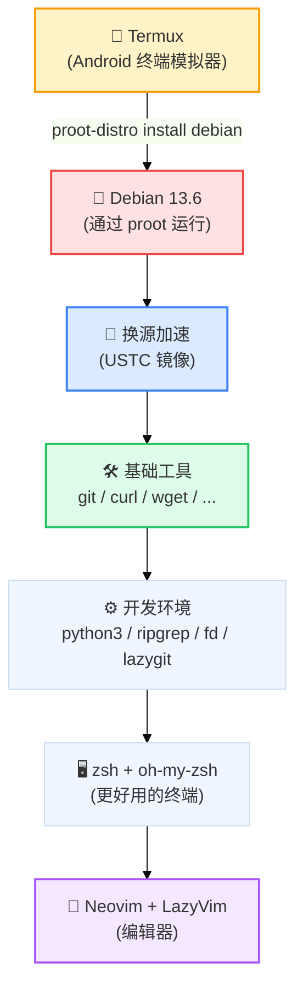
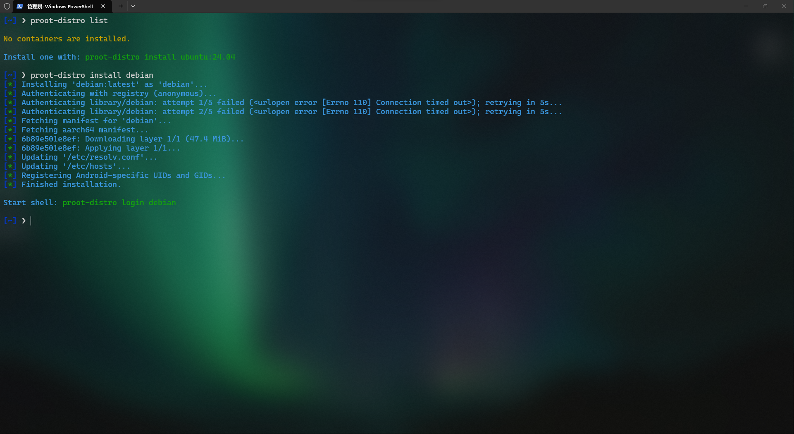
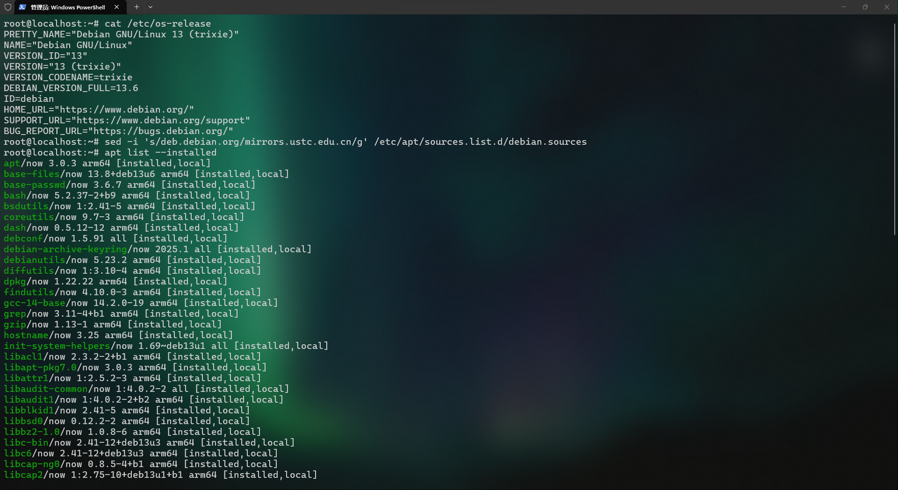

# Linux 入门配置和调试（以 Debian 13.6 为例）

---

::: info 💡 写在前面
- 适用环境：Debian 13.6（含在手机上通过 Termux + proot 搭建的虚拟环境）

- 教程目标：从零搭建一套适合写代码的 Linux 环境 —— 换源 → 装工具 → 配终端 → 装编辑器

- 读者对象：完全没接触过 Linux 的新手，文中每个名词都会解释

- 核心工具链：zsh + oh-my-zsh | Neovim + LazyVim | ripgrep + fd | lazygit
:::

::: tip 📢 注意
- 本文所有命令默认以 **root 用户**（Linux 的管理员账号）执行。如果你用的是普通用户，请在命令最前面加上 `sudo`（例如 `sudo apt install ...`）
- 文中的软件版本号（如 Debian 13.6）以写作日期为准，实际安装时可能已有更新，命令本身不受影响
- **如果你是重装的Linux系统，请先备份重要数据，以免丢失**
:::

- 🤔 为什么写这篇文章？
  - 很多新手第一次接触 Linux 时，面对黑乎乎的终端不知道该敲什么。本文把「装完系统之后该做什么」整理成一条完整的路线：**先让软件源跑得快，再装常用工具，最后把终端和编辑器打扮好用顺手**。照着敲一遍，你就有了一套能日常使用的 Linux 环境
- 🤔 为什么用 Debian 当例子？
  - Debian 是一个非常流行、非常稳定的 Linux 发行版，软件包数量多、社区资料丰富，而且它有一套特别好用的包管理器 `apt`——想装软件时一句命令就能搞定。手机端的 Termux 也支持一键安装 Debian，学到的命令完全通用

---

## 一、环境概览

### 完整依赖关系



### 新手名词速查表

| 名词 | 是什么 | 一句话解释 |
|------|--------|-----------|
| Linux 发行版 | 内核 + 一堆软件打包成的完整系统 | 内核是系统的心脏，发行版是「心脏 + 器官 + 皮肤」的完整套餐 |
| Debian | 一个老牌 Linux 发行版 | 以稳定著称，Ubuntu 就是它的衍生品 |
| 终端（Terminal） | 一个黑底白字的窗口 | 在里面敲命令和系统打交道 |
| Shell | 解释命令的程序 | 你敲一行字，它翻译给系统执行，bash / zsh 都是它 |
| apt | Debian 的包管理器 | 相当于手机上的「应用商店」，一条命令装软件 |
| 软件源 | 软件仓库的地址列表 | apt 从哪下载软件，就记录在这里 |
| 包（Package） | 一个可安装的软件单元 | 可以是一个程序，也可以是一套库文件 |

---

## 二、在手机上装一个 Debian（可选）

> 如果你想使用 Debian 或者其他 Linux 发行版，不需要买电脑——用 **Termux** 就能在 Android 上装一个 Debian。如果你用电脑（虚拟机 / 实体机 / WSL），可以直接跳到第三节。
> **注意:** 如果你只是想体验 Linux,你完全可以使用 **Termux** 体验,而没必要装 Debian。

**名词解释：**
- **Termux**：Android 上的终端模拟器应用，能在手机上运行 Linux 命令行环境
- **proot**：一种「假装自己是 root」的技术，不需要真的给手机 root（破解系统权限），就能在普通应用中运行完整的 Linux 发行版
- **proot-distro**：Termux 里专门用来安装和管理 Linux 发行版的工具

安装步骤（在 Termux 里依次执行）：

```bash
# 更新 Termux 自己的软件列表
pkg update

# 安装 proot-distro（发行版管理工具）
pkg install proot-distro

# 安装 Debian
proot-distro install debian

# 登录进入 Debian 系统
proot-distro login debian
```



::: info 💡 小提示
- `pkg` 是 Termux 自己的包管理器，语法和 `apt` 几乎一样（`pkg install 软件名`）
- 进入 Debian 后，你就有了一个完整的 Linux 环境，下面的所有内容都适用
- 以后想进入系统，只需要运行 `proot-distro login debian` 这一条命令
:::

---

## 三、先看看你的系统

装好系统后第一件事：**确认你用的是哪个版本、装了哪些软件**。这样后面出问题时，别人问你环境信息你能答上来。

**命令解释：**
- `cat`：把文件内容打印到屏幕上（concatenate 的缩写）
- `/etc/os-release`：Linux 系统保存「身份信息」的文件（版本号、名字等）

```bash
# 查看系统版本信息（推荐）
cat /etc/os-release

# 查看内核版本
uname -a
```

输出示例（Debian 13.6）：

```
PRETTY_NAME="Debian GNU/Linux 13 (trixie)"
NAME="Debian GNU/Linux"
VERSION_ID="13.6"
VERSION="13.6 (trixie)"
...
```

再看系统里默认装了哪些软件（`dpkg` 是 Debian 底层的包管理工具，`-l` 表示列出所有已安装的包，`head` 表示只显示前 10 行，防止刷屏）：

```bash
dpkg -l | head

# 或者用 apt, 如下图所示, 也可以用 Head 命令查看前10行
apt list --installed
```



::: tip 📢 注意
- 这里用到了管道符 `|`：它的作用是「把左边命令的输出，当作右边命令的输入」，是 Linux 里最常用的组合技，后面会频繁出现
- `uname -a` 中的 `a` 是 all 的意思，一次性显示内核版本、主机名、架构等所有信息
:::

---

## 四、第一步优化：换下载源

### 为什么要换源？

apt 默认从 Debian 官方服务器（`deb.debian.org`）下载软件。这个服务器在国外，国内访问速度很慢——装几个包可能要等半天。解决办法是**换成国内镜像站**（把官方仓库完整复制一份放到国内服务器）。本文用 **中科大镜像（USTC）**。

**名词解释：**
- **sed**：流编辑器（stream editor），可以按规则批量修改文本，这里用来改文件内容
- **镜像站**：官方软件仓库的国内「复制品」，访问快得多

### 修改软件源配置

Debian 13 的软件源配置存放在 `/etc/apt/sources.list.d/debian.sources` 文件里。用一条 `sed` 命令把里面的官方地址全部替换成国内镜像：

```bash
sed -i 's/deb.debian.org/mirrors.ustc.edu.cn/g' /etc/apt/sources.list.d/debian.sources
```

这条命令逐段拆解：

| 片段 | 含义 |
|------|------|
| `sed` | 调用 sed 编辑器 |
| `-i` | in-place，直接修改原文件（不加的话只输出到屏幕，不改文件） |
| `s/旧内容/新内容/g` | 替换命令：把「旧内容」换成「新内容」；开头的 `s` 是 substitute（替换），结尾的 `g` 是 global（全部替换，不只第一个） |
| `deb.debian.org` → `mirrors.ustc.edu.cn` | 把官方地址替换成中科大镜像地址 |
| `/etc/apt/sources.list.d/debian.sources` | 要修改的文件路径 |

### 刷新软件列表

改完源之后，让 apt 重新读取一次软件列表（同时验证源是否可用）：

```bash
apt update
```

::: info 💡 小提示
- 如果 `apt update` 报错，最常见的原因是**网络**（镜像站连不上）或**拼写错误**（地址写错）。可以先 `cat /etc/apt/sources.list.d/debian.sources` 检查文件内容是否被正确修改
- 除了中科大，国内常用的还有清华（`mirrors.tuna.tsinghua.edu.cn`）、阿里（`mirrors.aliyun.com`）等镜像，把上面命令里的地址换掉即可
:::

---

## 五、安装基础工具

下面这套工具几乎是 Linux 开发的「标配」，先全部装上：

```bash
apt install -y git curl wget p7zip-full dtrx build-essential
```

**命令解释：**
- `apt install`：安装软件包
- `-y`：yes，遇到询问自动回答「是」，避免安装过程中停下来等你确认

**每个工具是干什么的：**

| 工具 | 是什么 | 用来干嘛 |
|------|--------|---------|
| `git` | 版本控制工具 | 记录代码的每一次修改，方便回滚和多人协作，程序员必备 |
| `curl` | 命令行网络工具 | 从网址下载内容、调用接口（常用来下载安装脚本） |
| `wget` | 命令行下载工具 | 专门用来下载文件，支持断点续传 |
| `p7zip-full` | 压缩解压工具 | 处理 `.7z` 格式的压缩包（7-Zip 的命令行版） |
| `dtrx` | 智能解压工具 | 自动识别压缩包格式并解压，不用记各种解压参数 |
| `build-essential` | 编译工具集 | 包含 `gcc`（C 编译器）、`make`（构建工具）等，编译源码时必需 |

::: tip 📢 注意
- `curl` 和 `wget` 都能下载文件，区别是：`curl` 更擅长「请求接口 / 拿网页内容」，`wget` 更擅长「下载大文件 / 整站镜像」。两个都装上，用的时候哪个顺手用哪个
- 装了 `build-essential` 之后，以后 `apt install` 装那些需要现场编译的软件（比如某些 Python 包）时就不会报「缺少编译器」的错误了
:::

---

## 六、验证安装是否成功

装完不能白装，用一条命令确认每个工具都真正装上了：

```bash
dpkg -l git curl wget p7zip-full dtrx build-essential | grep '^ii' | awk '{print $2 " " $3}'
```

这条命令是三层管道的组合，逐段拆解：

| 片段 | 含义 |
|------|------|
| `dpkg -l 软件名...` | 查询这些软件包的状态（`-l` 是 list） |
| `\| grep '^ii'` | 只保留状态为 `ii` 的行——`ii` 表示「已安装且配置完成」，`^` 表示「行首」，即只匹配以 `ii` 开头的行 |
| `\| awk '{print $2 " " $3}'` | 从每行中取出第 2 列（包名）和第 3 列（版本号）并打印 |

**名词解释：**
- **grep**：文本过滤器，按规则挑出符合条件的行
- **awk**：文本处理工具，擅长把一行文本按空格拆成多列，再按列输出或计算

运行成功的话，你会看到类似这样的输出（每行一个软件 + 它的版本号）：

```
build-essential 12.12
curl            8.5.0-2
dtrx            8.5.3
git             1:2.45.2-1
p7zip-full      16.02+dfsg-8
wget            1.21.3-1+b2
```

::: info 💡 小提示
- 如果某个软件没装上，它的行就不会出现在输出里，说明安装过程出问题了，可以单独 `apt install 那个软件名` 重试一次
- 这条「`dpkg -l ... | grep '^ii' | awk`」组合是检查 Debian 系统里装了什么的万能配方，把后面跟着的软件名换成任何包名都能用
:::

---

## 七、安装开发环境

接下来装写代码常用的环境：

```bash
apt install -y python3 python3-pip python3-dev ripgrep fd-find lazygit
```

| 工具 | 是什么 | 用来干嘛 |
|------|--------|---------|
| `python3` | Python 编程语言（第 3 代） | 写脚本、做数据分析、开发 Web 应用都靠它 |
| `python3-pip` | Python 的包管理器 | 用 `pip install 包名` 安装第三方 Python 库 |
| `python3-dev` | Python 开发头文件 | 让 Python 能和 C 语言扩展库配合使用，装某些库时必需 |
| `ripgrep` | 极速搜索工具（命令是 `rg`） | 在文件/代码里搜关键词，比传统 `grep` 快很多 |
| `fd-find` | 极速找文件工具（命令是 `fdfind`） | 按名字找文件/目录，比传统 `find` 更易用 |
| `lazygit` | 终端里的 Git 图形界面 | 用按键操作代替敲 Git 命令，提交代码更直观 |

### 给 fd 起个短名字（符号链接）

`fd-find` 安装后的命令名是 `fdfind`（为了和系统里另一个叫 `fd` 的工具避冲突）。太长不好敲，我们用**符号链接**给它起个短别名：

```bash
ln -sf /usr/bin/fdfind /usr/local/bin/fd
```

**名词解释：**
- **ln**：创建链接（link）的命令
- `-s`：symbolic，创建**符号链接**（相当于 Windows 的「快捷方式」）
- `-f`：force，如果目标已存在就覆盖
- 这条命令的意思是：在 `/usr/local/bin/fd` 这个位置创建一个指向 `/usr/bin/fdfind` 的快捷方式。之后敲 `fd` 就等于敲 `fdfind`

::: tip 📢 注意
- `/usr/local/bin` 是 Linux 的 PATH（命令搜索路径）之一，放在这里的可执行文件可以直接用名字调用，不需要写完整路径
- 验证方法：敲 `fd --version`，如果能输出版本号就说明别名生效了
:::

---

## 八、安装终端字体

写代码时终端里经常要显示各种图标（比如 git 的分支符号、文件夹图标）。普通字体没有这些符号，会显示成乱码方块。解决办法是安装 **Nerd Font**（专门为程序员打造的、自带上千个图标的字体）。

本文用 **fnt**（一个字体管理工具）来安装 **JetBrains Mono** 的 Nerd Font 版本：

```bash
# 安装 fnt 字体管理工具
apt install -y fnt

# 更新字体列表（从网络拉取可用字体的索引）
fnt update

# 安装 JetBrains Mono 字体
fnt install google-JetBrains-Mono

# 搜索还有哪些 Nerd Font 字体可选
fnt search nerd

# 刷新系统字体缓存，让新字体立即生效
fc-cache -fv
```

**命令解释：**

| 命令 | 含义 |
|------|------|
| `fnt update` | 更新字体库索引，相当于给 apt 的 `update` |
| `fnt install 字体名` | 安装指定字体 |
| `fnt search 关键词` | 搜索可用字体（试试 `fnt search nerd` 看看有哪些 Nerd Font） |
| `fc-cache -fv` | 重建字体缓存：`-f` 强制重建，`-v` 显示详细过程 |

::: info 💡 小提示
- 安装完成后，去你的终端/编辑器设置里把字体手动切换成 `JetBrainsMono Nerd Font`（名字可能带 Mono/Nerd 字样），图标才能显示出来
- 如果你的环境是 Termux，也可以在 Termux 的设置里换字体；换完后重新打开终端即可生效
:::

---

## 九、把终端升级成 zsh

系统默认的 shell 是 bash（Bourne Again Shell），能用但不够好看。**zsh** 是它的增强版，配合 **oh-my-zsh** 框架，能获得自动补全、主题美化、插件管理等功能。

**名词解释：**
- **zsh**：一个功能更强大的 shell（Z Shell）
- **oh-my-zsh**：zsh 的配置框架，内置大量主题和插件

安装 zsh：

```bash
apt install -y zsh
```

安装 oh-my-zsh（注意这条命令用了第三节学到的 `curl`，从 GitHub 下载安装脚本并执行）：

```bash
sh -c "$(curl -fsSL https://raw.github.com/ohmyzsh/ohmyzsh/master/tools/install.sh)" "" --unattended
```

**命令拆解：**

| 片段 | 含义 |
|------|------|
| `sh -c "..."` | 用 sh（shell）执行双引号里的命令串 |
| `$(...)` | 命令替换：先执行括号里的命令，把它的输出替换到当前位置 |
| `curl -fsSL 网址` | 下载安装脚本。`-f` 失败时报错，`-s` 静默（不显示进度条），`-S` 出错时显示错误，`-L` 跟随重定向（GitHub 的下载地址会自动跳转，必须加） |
| `--unattended` | 无人值守模式，安装过程不提问，适合脚本化安装 |

把默认登录 shell 切换成 zsh：

```bash
chsh -s $(which zsh) root
```

**命令拆解：**
- `chsh`：change shell，修改用户的登录 shell
- `-s`：指定新的 shell 路径
- `$(which zsh)`：先执行 `which zsh`（查找 zsh 安装在哪里，通常是 `/usr/bin/zsh`），再把结果作为参数
- `root`：对 root 用户生效

::: info 💡 小提示
- 如果 `chsh` 提示需要密码，说明你用的是普通用户，改成 `sudo chsh -s $(which zsh) $USER` 即可（`$USER` 是当前用户名）
- 修改后**重新登录**终端才会生效。生效后你会发现：命令提示符变好看了、敲命令能自动补全、按方向键上能搜索历史命令
:::

---

## 十、安装 Neovim 编辑器

### 为什么不用 apt 装？

`apt install neovim` 虽然能装，但 Debian 仓库里的版本通常比较旧。Neovim 官方推荐用 **AppImage** 方式安装最新版。

**名词解释：**
- **Neovim**：现代版 Vim 编辑器（`nvim`），命令行的代码编辑器，插件生态非常强大
- **AppImage**：一种「单文件」应用格式，一个文件就是一个完整程序，下载后加执行权限就能运行，无需安装
- **PATH**：系统搜索命令的目录列表，`/usr/local/bin` 是其中之一，里面的程序可以直接用名字调用

### 下载并安装

先确认你的 CPU 架构（64 位电脑一般是 `x86_64`，手机/ARM 设备是 `aarch64`）：

```bash
uname -m
```

然后下载对应的 AppImage（以 x86_64 为例）：

```bash
curl -LO https://github.com/neovim/neovim/releases/latest/download/nvim-linux-x86_64.appimage
```

**命令拆解：**
- `-L`：跟随重定向（GitHub 下载地址会跳转，必须加）
- `-O`：Output，把下载的内容保存为文件，并沿用服务器上的文件名（`nvim-linux-x86_64.appimage`）

给文件加上「可执行」权限：

```bash
chmod +x nvim-linux-x86_64.appimage
```

**名词解释：** `chmod`（change mode）修改文件权限，`+x` 表示加上执行（execute）权限。不加这步，文件只是数据，系统不允许运行它。

把文件移动到系统命令目录，实现「全局安装」（在任何目录敲 `nvim` 都能启动）：

```bash
mv nvim-linux-x86_64.appimage /usr/local/bin/nvim
```

**名词解释：** `mv`（move）移动文件，这里顺便把名字从一长串改成了简短的 `nvim`。移动到 `/usr/local/bin` 后，它就在 PATH 里了，任何地方都能直接调用。

### 验证安装

```bash
file /usr/local/bin/nvim
```

`file` 命令会显示文件的真实类型。如果输出里包含 **ELF 64-bit** 之类的字样，说明它是一个正常的可执行程序，安装成功。你也可以直接运行 `nvim --version` 看版本号。

::: tip 📢 注意
- **ARM 设备**（手机、树莓派等，`uname -m` 输出 `aarch64`）请下载 `nvim-linux-arm64.appimage`，把上面命令里的文件名替换掉即可
- 如果 AppImage 运行时提示缺少 FUSE 库（AppImage 的运行依赖），可以先 `apt install -y libfuse2` 解决
- 想省事的话也可以用 `snap install nvim --classic` 安装（需要系统支持 snap），效果一样
:::

---

## 十一、一键获得好看的编辑器（LazyVim）

裸的 Neovim 配置起来很麻烦。**LazyVim** 是一套开箱即用的 Neovim 配置方案：装好之后，文件树、代码补全、语法高亮、Git 状态显示……全都帮你配好了。

**名词解释：**
- **LazyVim**：社区维护的 Neovim「配置发行版」，包含上百个精选插件和合理默认设置
- **~/.config/nvim**：Neovim 读取配置的目录（`~` 表示当前用户的主目录）

```bash
# 如果之前配置过 nvim，先把旧配置备份走（2>/dev/null 屏蔽报错，|| true 表示即使失败也继续）
mv ~/.config/nvim ~/.config/nvim.bak 2>/dev/null || true

# 下载 LazyVim 的官方入门模板
git clone https://github.com/LazyVim/starter ~/.config/nvim

# 删除模板自带的 .git 目录，让这个配置变成「你自己的」仓库（方便以后自己改、自己提交）
rm -rf ~/.config/nvim/.git
```

**命令拆解：**

| 片段 | 含义 |
|------|------|
| `mv 旧路径 新路径` | 重命名/移动，这里把旧配置改名为 `.nvim.bak`（备份） |
| `2>/dev/null` | 把错误信息（第 2 号输出流）丢弃到「黑洞」设备 `/dev/null`——即「没有备份就算了，别报错」 |
| `\|\| true` | 逻辑或：前一条命令失败（返回非零）时，执行 `true`（永远成功的命令），保证整行命令不中断 |
| `git clone 网址 目录` | 从 GitHub 把整个仓库（所有文件+历史）下载到指定目录 |
| `rm -rf 目录` | 删除目录。`-r` 递归删除内部所有内容，`-f` 强制不询问。**危险命令，用前一定确认路径没写错** |

安装完成！第一次启动 nvim，它会自动下载并安装全部插件（可能需要几分钟）：

```bash
nvim
```

::: info 💡 小提示
- 首次启动时看到插件进度条，耐心等它跑完；下次启动就是秒开了
- 常用操作：`空格` + `e` 打开文件树；`空格` + `f` 查找文件；`:q` 退出，`:w` 保存，`:wq` 保存并退出
- 想自定义配置？打开 `~/.config/nvim/lua/config/` 下的文件直接改，改完重启 nvim 生效
:::

---

## 十二、常见问题（FAQ）

| 问题 | 原因 | 解决办法 |
|------|------|---------|
| `apt update` 报错 | 网络不通 / 源地址写错 | `cat /etc/apt/sources.list.d/debian.sources` 检查内容；确认网络能访问镜像站 |
| `apt install` 提示找不到软件 | 软件列表太旧 | 先运行 `apt update` 刷新列表再装 |
| 提示 `Permission denied` | 没有权限 | 命令前面加 `sudo`，或用 root 用户执行 |
| `nvim` 提示找不到命令 | 没装成功 / 不在 PATH | 重新检查第十节：`file /usr/local/bin/nvim` 是否显示 ELF；确认路径是 `/usr/local/bin` |
| 终端里图标显示成方块 | 字体不支持图标 | 安装 Nerd Font 并在终端设置里切换字体（见第八节） |
| `chsh` 后没生效 | 需要重新登录 | 退出终端重新进入，或执行 `zsh` 手动切换 |
| LazyVim 打开后是空白的 | 插件没装完 / 首次启动被中断 | 删除 `~/.config/nvim` 后重新 `git clone` 再启动，等待插件安装完成 |
| 想回到 bash | 不习惯 zsh | `chsh -s /bin/bash root` 切回去 |

---

::: tip 🎉 写在最后
到这里，你的 Linux 环境就基本齐活了：**国内镜像加速的 apt + 一整套开发工具 + 好看好用的 zsh 终端 + 开箱即用的 Neovim 编辑器**。接下来就是多敲多练——遇到问题先自己 `man 命令名`（查看命令手册）或网上搜，解决一个记一个，进步会非常快。祝你玩得开心！
:::

